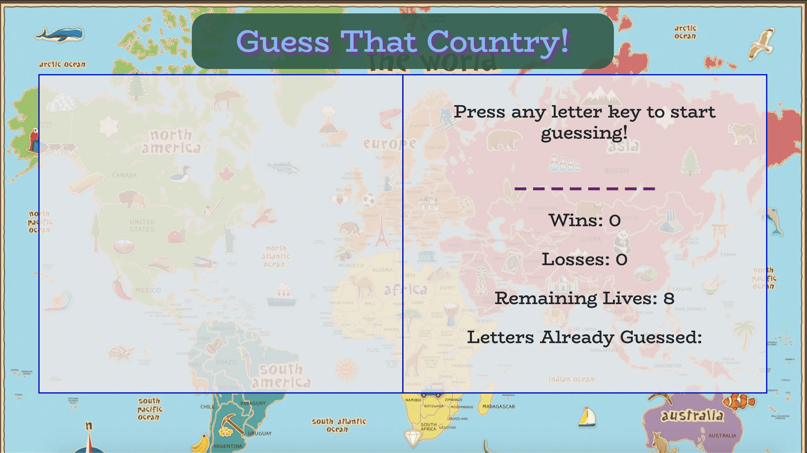
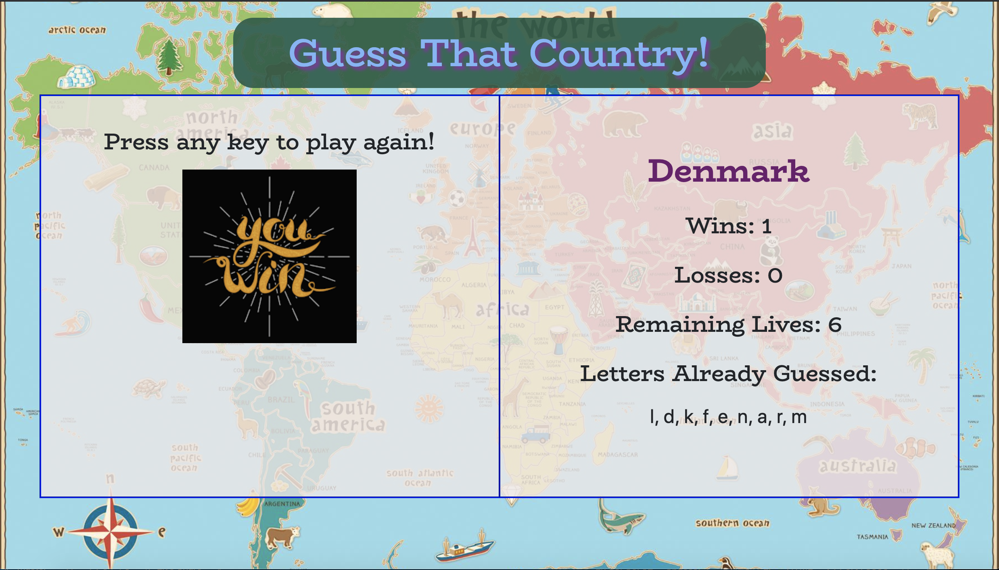
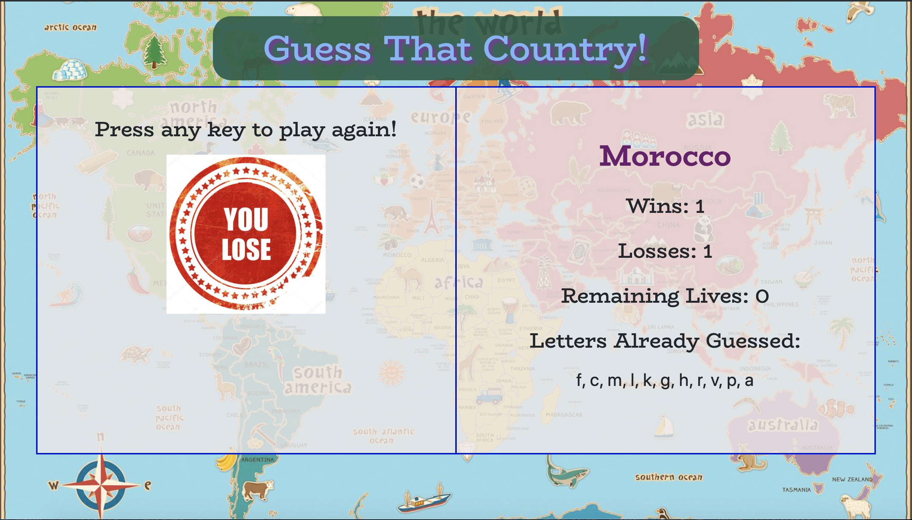

# Guess that Country

## Description

An interactive word guess game. Players will be given 8 chances to guess a randomly selected country. If the player can guess correctly in under 8 guesses, they win a point. Otherwise, they will lose a point. With another click of the keyboard, players will then be given another chance at guessing a newly selected country.

### Languages and Tools used

* HTML
* CSS
* JavaScript
* Google Fonts
* Bootstrap

